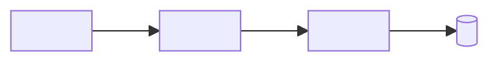

<!--
  Plantilla de README de Milpia. Guía: https://github.com/Milpia/.github/blob/main/guia/estilo.md
  Copia este archivo como README.md, reemplaza lo que está entre <> y borra
  las secciones que no apliquen. Los comentarios HTML como este no se ven en GitHub.
-->

<div align="center">

# Milpia · <Nombre del proyecto>

**<Una frase de valor: qué consigue alguien con esto, no qué tecnología usa.>**

<!-- Solo badges de estado real. Un badge por workflow que importe. -->
[](https://github.com/Milpia/<repo>/actions/workflows/<ci>.yml)
[](https://github.com/Milpia/<repo>/actions/workflows/<deploy>.yml)

[Empieza aquí](#-empieza-aquí) · [Documentación](docs/README.md) · [Reglas](AGENTS.md)

</div>

---

## ✨ En 30 segundos

- **Qué es:** <una línea>.
- **Dónde corre:** <una línea>.
- **Cómo se cambia:** <una línea: spec → PR → despliegue, por ejemplo>.

## 🗺️ Cómo encaja

<!-- De 8 a 12 cajas. Lo que alguien nuevo necesita para orientarse, no todo. -->


<details>
<summary><b>Diagrama detallado</b></summary>

<!-- El diagrama completo, si existe. -->

</details>

## 🧭 Empieza aquí

| Si vienes a… | Empieza por |
|---|---|
| **<usarlo por primera vez>** | [<docs/…>](docs/…), paso a paso |
| **<operarlo>** | [<docs/…>](docs/…) |
| **<cambiarlo>** | [<docs/…>](docs/…) y las [reglas de trabajo](AGENTS.md) |

## 🧱 Stack

| Capa | Pieza | Para qué |
|---|---|---|
| <capa> | **<tecnología>** | <una línea> |

<details>
<summary><b>Versiones y detalle</b></summary>

<!-- Versiones fijadas, decisiones y enlaces a las specs. -->

</details>

## 🔁 Cómo se trabaja

```text
spec ─► plan ─► tareas ─► PR revisado ─► despliegue ─► evidencia
```

<Dos o tres líneas: dónde viven las specs, cómo se refleja en Jira y quién revisa.>

## 📚 Documentación

La puerta de entrada es [`docs/README.md`](docs/README.md). Un archivo por pregunta:

- [`docs/<tema>.md`](docs/<tema>.md): <la pregunta que responde>.

## 🤝 Contribuir

- [`AGENTS.md`](AGENTS.md): lo que nunca se hace, el flujo de git y el manejo de secretos.
- <Constitución o principios, si los hay.>

---

<div align="center"><sub>Parte de <a href="https://github.com/Milpia">Milpia</a> · documentado con la <a href="https://github.com/Milpia/.github/blob/main/guia/estilo.md">guía de estilo</a> compartida.</sub></div>
